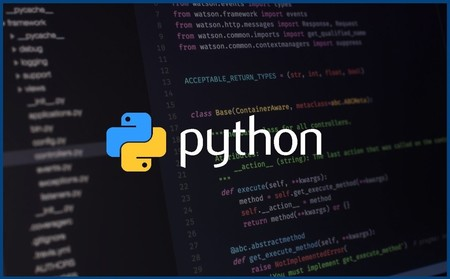

# Curso de Python #

Este es un curso completo de Python, diseñado para llevar a cualquier persona desde principiantes hasta programadores experimentados. A lo largo de este curso, aprenderás los conceptos básicos de la programación y cómo aplicarlos en Python.

## Temas cubiertos ##
1. Introducción a la programación y a Python
2. Tipos de datos básicos y operadores en Python
3. Manejo de Strings en Python
4. Listas en Python
5. Estructuras de control de flujo (if, for, while)
6. Sets, diccionarios y tuplas en Python
7. Funciones
8. Módulos y paquetes
9. Introducción a la orientación a objetos

## Requisitos previos ##
Este curso asume que no tienes experiencia previa en programación. Sin embargo, se recomienda tener una comprensión básica de cómo funciona una computadora (por ejemplo, saber cómo usar un sistema operativo y cómo navegar por archivos y carpetas).

## ¿Cómo seguir este curso? ##
Este curso se divide en lecciones temáticas, cada una de las cuales se divide en múltiples ejercicios y problemas prácticos. Se recomienda seguir el curso en orden, completando cada lección antes de pasar a la siguiente.

Cada lección incluye explicaciones escritas y videos, así como ejercicios y problemas para poner en práctica lo que has aprendido. También hay un foro donde puedes hacer preguntas y obtener ayuda de otros estudiantes y del profesor.

## ¿Qué necesitas para seguir este curso? ##
Para seguir este curso, necesitarás una computadora con Python 3 instalado. También se recomienda utilizar un editor de código (como PyCharm o Visual Studio Code) y descargar los archivos de ejemplo y ejercicios del curso.

## ¿Qué puedes esperar de este curso? ##
Al final de este curso, deberías tener una comprensión sólida de los conceptos básicos de la programación y cómo aplicarlos en Python. También deberías ser capaz de escribir programas simples y resolver problemas de programación utilizando Python. Si completas todos los ejercicios y problemas del curso, deberías estar bien preparado para continuar aprendiendo Python a un nivel intermedio-avanzado.